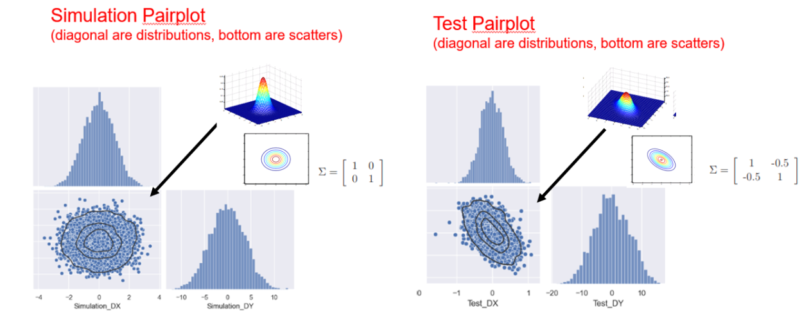

# Analyze-centers-disp-DF
 analytics from los displacements 

This Script takes a "centers_displ.csv" file i.e. - the center X,Y displacements of - 2 objects  and returns Pairplots, Histograms, Q-Q plots and Distributions comparison betqeen the
LoS of each center (simulation / test centers)
The output units (pixel / urad) can be controlled by "IFOV" parameter and "USE_ANGULAR" flag.

steps:
1. Duplicate "centers_displ.csv" -> one for test and one for simulation -> make sure you know which is which -> for each of the files, change columns titles to be "Center_0..." (i.e. not  "Center_1...")
2. "center_title" var is controlling the titles of the plots. change it if necessary.
3. Run the script and pick ".csv" files according to the screen prints instructions.
4. after each selection the script will plot the above mentioned plots.

Notes:
* The plots are not saved automatically
* there are 3 main functions that could be commented / uncommented:
    1. Pairplot - makes paiplots
    2. Histograms - makes hisograms , Q-Q plots
    3. compare_dist - plots 2 hisograms (test / simulation) to compare the dists.

** V01 - 06/07/22 What's new?
    1. Added: Correlation Heatmap and Distributions comparison plots
    2. Auto - Saving Figures